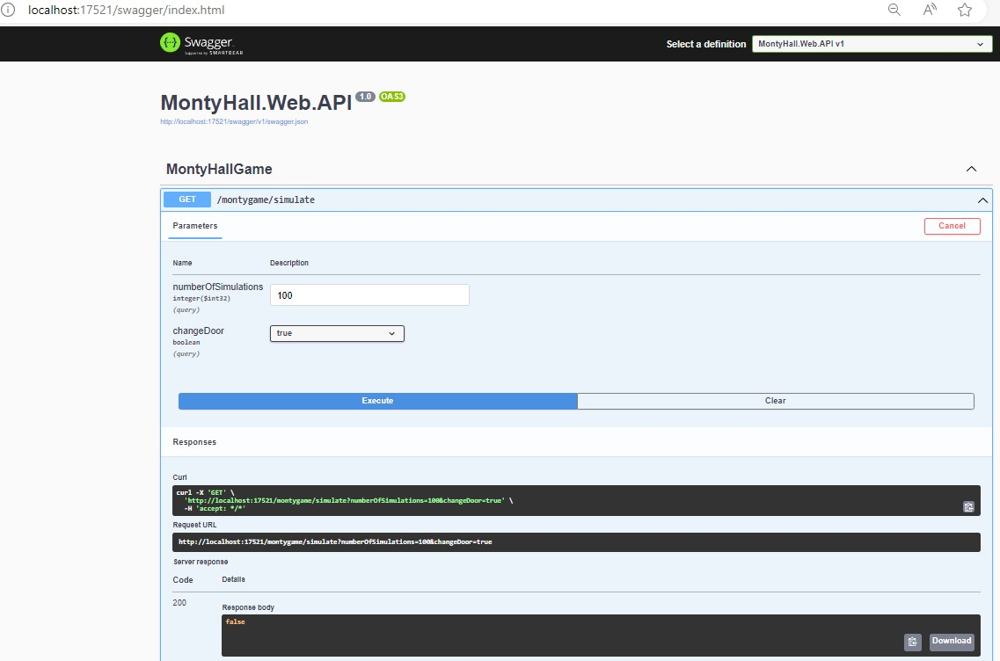
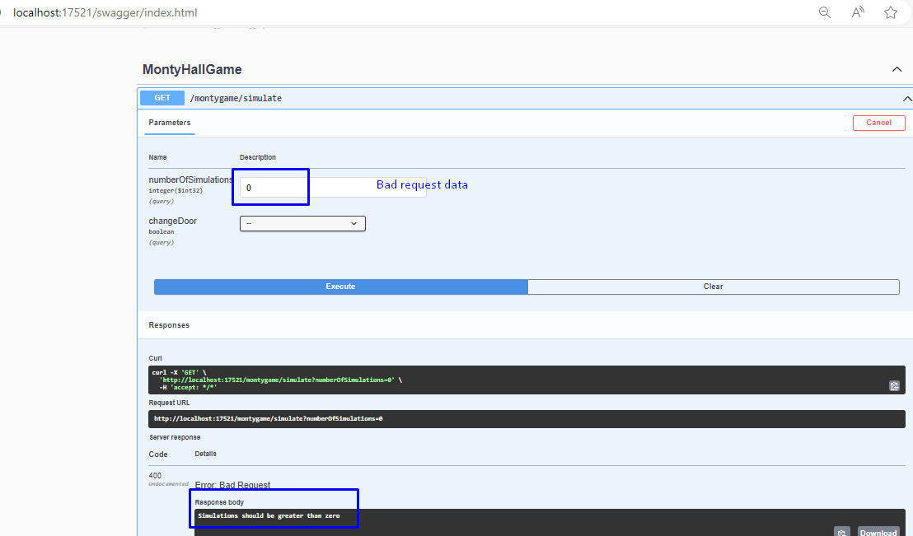

# Requirements

1. The concept of the game is that the player sees three closed doors behind one is a car. and behind the other two are goats.
2. Player: choose a door, without opening it.
3. Presenter: opens one of the two remaining doors (but never the one with the car) and shows that this door does not contain profit.
4. Player: given another choice to change the door. 
5. Question: is whether the chances of winning increase if the player changes the door?
6. The application: should be able to simulate a given number of games and whether you change the door or not. TestCase 1.
7. In the interface you should be able to: enter a number of simulations and choose whether or not to change the door. 
8. Then be able to press a button that starts the simulation by: calling backend that performs the requested number of simulated games.
9. When backend answers then the results of the simulations should be printed
10. All existing unit tests should be updated to reflect the above requirements and new tests should be written to cover anything missing.

# Backend tasks
1. In the interface you should be able to: enter a number of simulations and choose whether or not to change the door
2. then the results of the simulations should be printed.

# Suggested Backend APIs
As per requirment # 6, suggested API
1. GET `/montygame/simulate?numberOfSimulations=int&changeDoor=bool`: returns the result of simulations whether is user winning or not by returning true or false 

# Assumptions
- No code was provided in the task or unit testing hence the last requirment #10 is not valid
- Use Test Driven Development for simplicity and targeting requirements
- Use Random C# library for picking the next door
- For simplicity backend stores default value for number of doors
- For simplicity backend randmoly choose user door in each iteration

# API Documentation & trial in Swagger
- Success response with status code 200 OK

- BadRequest response with status code 400 OK
